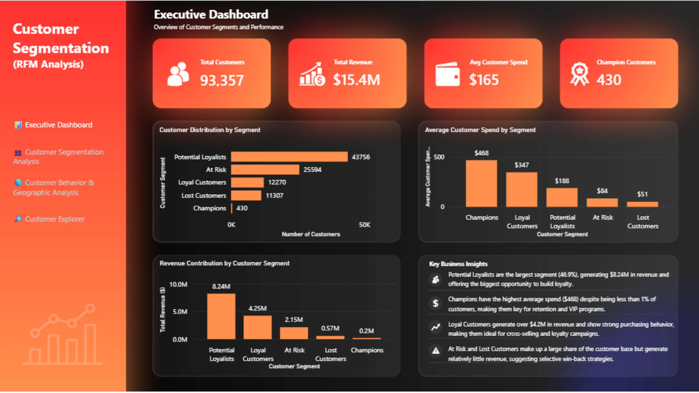
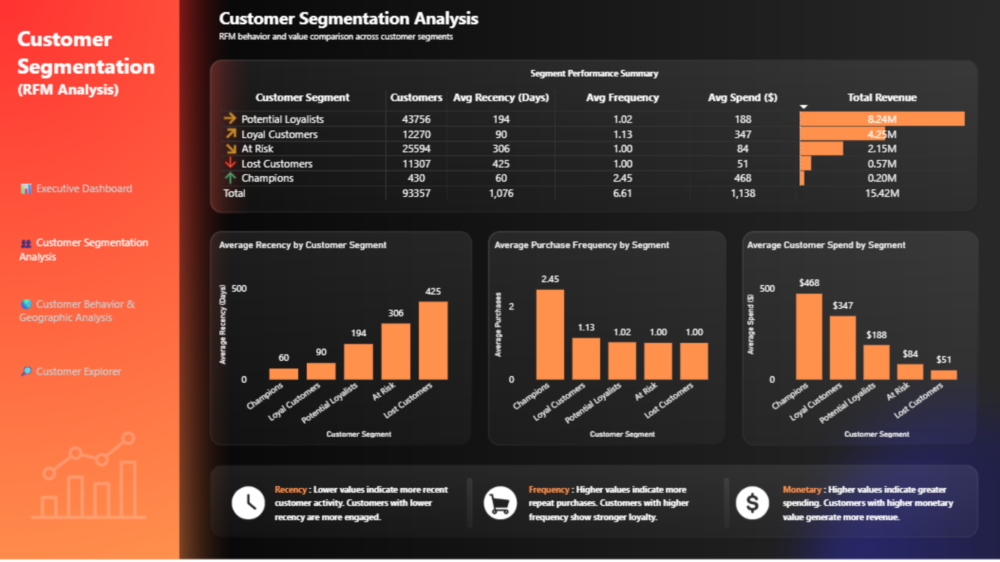
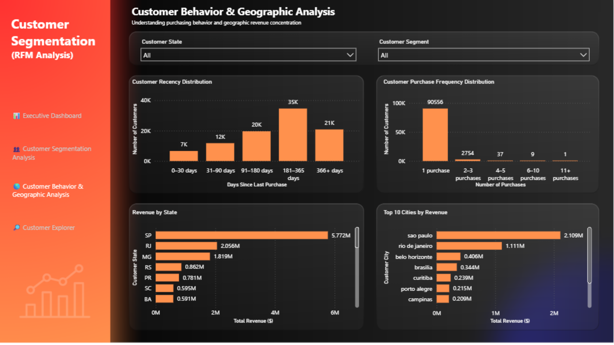
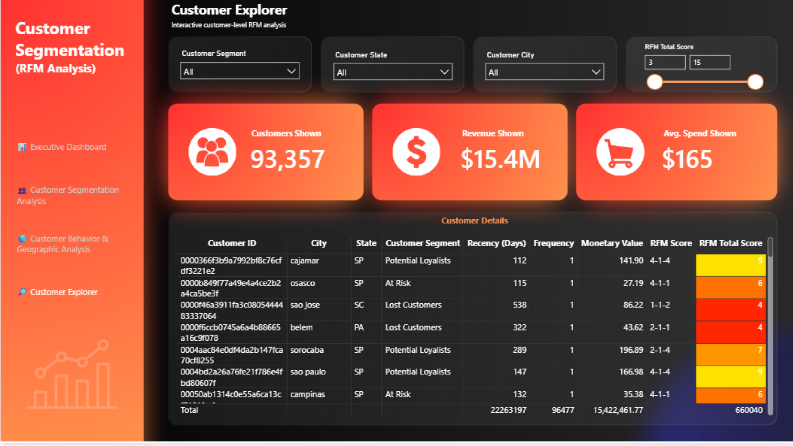

# Customer Segmentation & RFM Analysis

## 📊 Project Overview

Customer segmentation helps businesses understand how customers behave, identify high-value customers, and prioritize retention and growth opportunities.

This project analyzes customer purchasing behavior using **RFM (Recency, Frequency, Monetary) analysis** and transforms the results into an interactive **Power BI dashboard**.

The project follows an end-to-end analytics workflow:

**PostgreSQL → Python/Pandas → RFM Analysis → Customer Segmentation → Power BI → Business Insights**

---

## 🎯 Business Problem

A large customer base can contain very different types of customers. Treating every customer the same can lead to inefficient marketing and retention spending.

The objective of this project is to answer:

- Who are the most valuable customers?
- Which customers are most likely to purchase again?
- Which customers are at risk of becoming inactive?
- Which customer segments generate the most revenue?
- Where are customers and revenue geographically concentrated?
- How can marketing efforts be prioritized across segments?

---

## 🗂️ Dataset

The project uses the **Olist Brazilian E-Commerce** dataset.

After data preparation and customer-level aggregation, the final RFM dataset contains:

- **93,357 customers**
- **14 customer-level attributes**
- Customer location information
- Recency, Frequency, and Monetary metrics
- Individual RFM scores
- RFM total score
- Customer segment classification

---

## 🧮 RFM Methodology

RFM analysis evaluates customers using three dimensions:

### Recency
How many days have passed since the customer's most recent purchase.

**Lower recency = more recent activity**

### Frequency
How many purchases the customer has made.

**Higher frequency = stronger repeat-purchase behavior**

### Monetary
How much revenue the customer has generated.

**Higher monetary value = higher customer value**

Each RFM component is scored from **1 to 5**, producing an overall RFM profile and total score.

---

## 👥 Customer Segments

The analysis classifies customers into five business-oriented segments:

| Segment | Customers | Avg. Recency | Avg. Frequency | Avg. Spend | Total Revenue |
|---|---:|---:|---:|---:|---:|
| Potential Loyalists | 43,756 | 194 days | 1.02 | $188.41 | $8.24M |
| Loyal Customers | 12,270 | 90 days | 1.13 | $346.55 | $4.25M |
| At Risk | 25,594 | 306 days | 1.00 | $84.12 | $2.15M |
| Lost Customers | 11,307 | 425 days | 1.00 | $50.61 | $0.57M |
| Champions | 430 | 60 days | 2.45 | $468.13 | $0.20M |

---

## 🔍 Key Business Insights

### 1. Potential Loyalists represent the largest opportunity

Potential Loyalists account for approximately **46.87% of customers** and generate approximately **$8.24M in revenue**.

Their scale makes them the largest opportunity for increasing repeat purchases.

**Recommended action:** Use personalized recommendations, second-purchase incentives, and targeted follow-up campaigns.

### 2. Champions have the highest individual customer value

Champions represent only **430 customers**, but they have the highest average spend (**$468.13**) and purchase frequency (**2.45**).

**Recommended action:** Protect these relationships through VIP programs, exclusive offers, early access, and referral initiatives.

### 3. Loyal Customers generate high-quality revenue

Loyal Customers generate approximately **$4.25M** with an average spend of **$346.55**.

**Recommended action:** Focus on loyalty programs, cross-selling, and retention campaigns.

### 4. At Risk customers represent a major retention opportunity

At Risk customers represent approximately **27.42% of the customer base** and have an average recency of **306 days**.

**Recommended action:** Use targeted win-back campaigns before these customers become Lost Customers.

### 5. Lost Customers require selective reactivation

Lost Customers have an average recency of approximately **425 days** and generate relatively little revenue compared with the larger active segments.

**Recommended action:** Evaluate reactivation costs and prioritize customers with the highest potential return.

---

## 📈 Power BI Dashboard

The final Power BI report contains four interactive pages.

### 📊 1. Executive Dashboard

Provides a high-level view of:

- Total customers
- Total revenue
- Average customer spend
- Champion customers
- Customer distribution by segment
- Revenue contribution by segment
- Average customer spend by segment
- Key business insights



---

### 👥 2. Customer Segmentation Analysis

Compares the five customer segments using:

- Segment performance table
- Average recency
- Average purchase frequency
- Average customer spend
- Customer segment slicer
- RFM interpretation



---

### 🌎 3. Customer Behavior & Geographic Analysis

Explores customer behavior and geographic patterns using:

- Customer recency distribution
- Purchase frequency distribution
- Revenue by state
- Top 10 cities by revenue
- Customer state slicer
- Customer segment slicer



---

### 🔎 4. Customer Explorer

Provides customer-level exploration using:

- Customer segment filter
- State filter
- City filter
- RFM score filter
- Customers shown KPI
- Revenue shown KPI
- Average spend shown KPI
- Detailed customer-level RFM table



---

## 🛠️ Tools & Technologies

| Tool | Purpose |
|---|---|
| PostgreSQL | Data extraction and SQL analysis |
| Python | Data preparation and analysis |
| Pandas | Data manipulation and RFM calculations |
| Jupyter Notebook | Exploratory analysis and documentation |
| Matplotlib | Data visualization |
| Power BI | Interactive dashboard and reporting |
| GitHub | Version control and portfolio presentation |

---

## 🔄 Project Workflow

```text
Raw E-Commerce Data
        ↓
PostgreSQL / SQL Analysis
        ↓
Data Cleaning & Preparation
        ↓
Customer-Level Aggregation
        ↓
RFM Calculation
        ↓
RFM Scoring
        ↓
Customer Segmentation
        ↓
Business Insights
        ↓
Power BI Dashboard
```

---

## 📁 Repository Structure

```text
customer-segmentation-rfm-analysis/
│
├── data/
│   ├── raw/
│   └── processed/
│
├── notebooks/
│   └── rfm_analysis.ipynb
│
├── sql/
│
├── outputs/
│   ├── customer_rfm_final.csv
│   └── segment_summary.csv
│
├── images/
│   ├── executive_dashboard.png
│   ├── customer_segmentation.png
│   ├── behavior_geographic.png
│   └── customer_explorer.png
│
├── powerbi/
│   └── customer_segmentation_dashboard.pbix
│
├── requirements.txt
├── README.md
└── .gitignore
```

---

## 💡 Business Recommendations

Based on the segmentation results, marketing resources should be prioritized according to customer value and growth potential:

1. **Convert Potential Loyalists into Loyal Customers** through second-purchase campaigns.
2. **Protect Champions** with VIP treatment and relationship-building initiatives.
3. **Retain Loyal Customers** through loyalty programs and cross-selling.
4. **Win back At Risk customers** before inactivity increases further.
5. **Use selective reactivation strategies** for Lost Customers where expected return justifies the cost.

---

## 📌 Project Outcome

This project demonstrates an end-to-end data analytics workflow that combines:

- SQL
- Data cleaning
- Python/Pandas
- RFM analysis
- Customer segmentation
- Business interpretation
- Interactive Power BI reporting

The final result transforms raw transactional data into actionable customer insights that can support **marketing prioritization, customer retention, and revenue growth decisions**.
